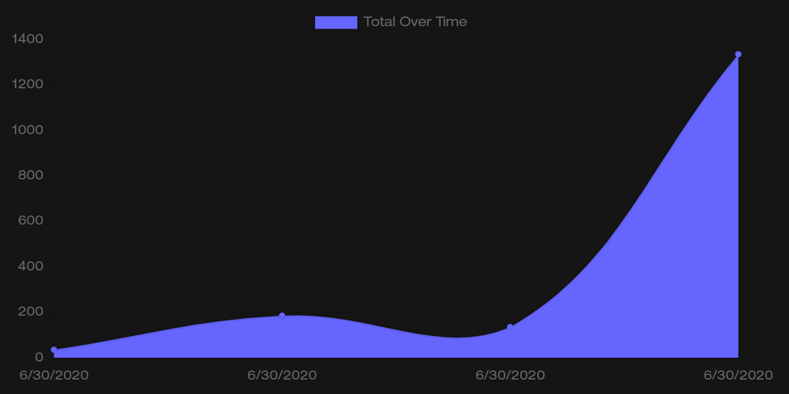

# Budget Tracker

---

### Table of Contents

- [Description](#description)
- [How to Use](#how-to-use)
- [Installation](#installation)
- [Technologies](#technologies)
- [License](#license)
- [Contributors](#contributors)

---

### Description

Budget Tracker is a web application to track your income & expenses. It's especially helpful when traveling due to the offline functionality. When you're offline, you can keep tracking your transactions and the application will sync when you get a connection again.

---

### How to Use

1. [Open the application](https://shiftymitch-budget-tracker.herokuapp.com/) in your browser.
2. Add a transaction name & amount, then click +Add or -Subtract to add it to your budget.

---

### Installation

Budget Tracker is live [here](https://shiftymitch-budget-tracker.herokuapp.com/)

---

### Technologies

[Express](https://expressjs.com/)\
[Mongoose](https://mongoosejs.com/)\
[IndexedDB](https://javascript.info/indexeddb)

---

### License

MIT © [shiftymitch](https://github.com/shiftymitch)

---

### Contributors

| Developer | GitHub |
| ------ | ------ |
| Mitch Henderson | [shiftymitch](https://github.com/shiftymitch) |

[Back to the Top](#project-name)
